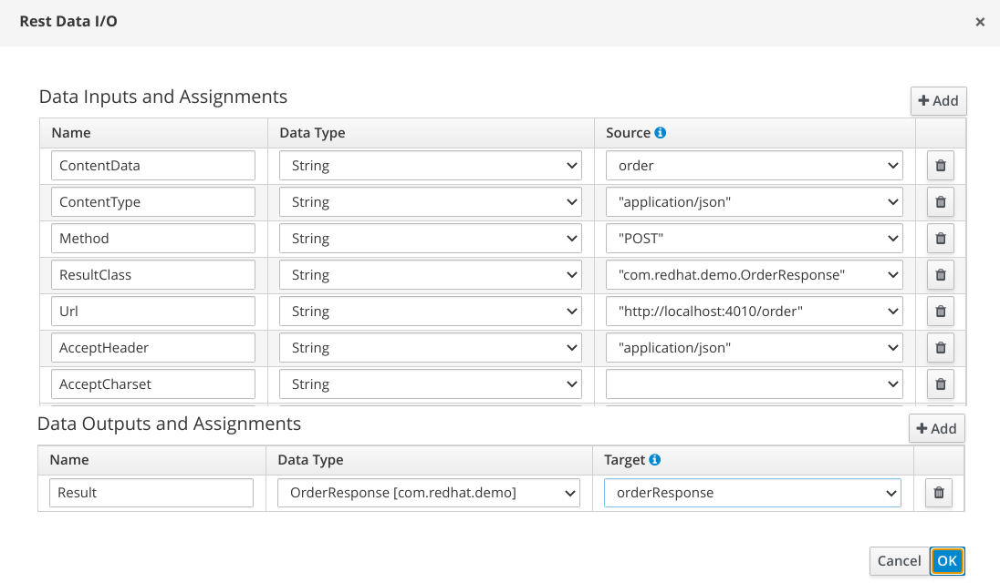
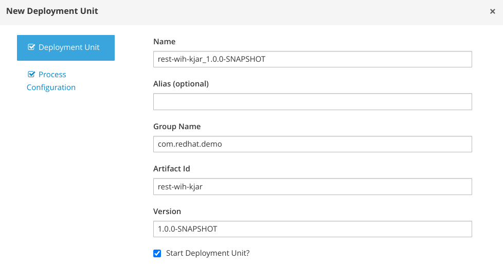

# REST WorkItemHandler usage

## Generate the kjar

```sh
mvn archetype:generate \
-DarchetypeGroupId=org.kie \
-DarchetypeArtifactId=kie-kjar-archetype \
-DarchetypeVersion=7.59.0.Final-redhat-00009 \
-Dversion=1.0.0-SNAPSHOT \
-DgroupId=com.redhat.demo \
-DartifactId=rest-wih-kjar
```

Update the pom file to use Java 11:

```xml
    <maven.compiler.target>11</maven.compiler.target>
    <maven.compiler.source>11</maven.compiler.source>
```

## Java Object Model

For sake of simplicity, a simple Java Object Model is defined inside the project to handle the request and the response.

- Request Data Type [Order](rest-wih-kjar/src/main/java/com/redhat/demo/Order.java)
- Response Data Type [OrderResponse](rest-wih-kjar/src/main/java/com/redhat/demo/OrderResponse.java)

## Configure the WorkItemHandler

Add the REST WIH definition in the kie deployment descriptor (`rest-wih-kjar/src/main/resources/META-INF/kie-deployment-descriptor.xml`)

```xml
  <work-item-handlers>
    <work-item-handler>
      <resolver>mvel</resolver>
      <identifier>new org.jbpm.process.workitem.rest.RESTWorkItemHandler(classLoader)</identifier>
      <parameters />
      <name>Rest</name>
    </work-item-handler>
  </work-item-handlers>
```

In the folder `rest-wih-kjar/src/main/resources/proc` create the file `rest.wid` and add the content [here](rest-wih-kjar/src/main/resources/proc/rest.wid).

Optionally, add the WIH icon.

## Design the process

- Create the process `rest_call.bpmn` in `rest-wih-kjar/src/main/resources/proc` folder

- Change the process package in `proc`

- Design a process as in the following picture

  

- Configure the REST service data assignments:

  

- Click the SVG button in visual studio code to generate the svg file

## Build and install the kjar

```sh
mvn clean install
```

## Deploy the kjar through the Business Central

In the **Execution servers** page add a new deployment unit:



**WARNING** You should get a discaimer which says that the kjar artifact is not deployed in the maven repo of the business central. This is not an issue as long as the BC have access to the maven repo where the kjar is installed. Otherwise you can deploy the kjar inside the BC internal maven repo.

## Run the API mock server

```sh
podman run --rm -it -v ./rest-mock-server:/root/apis:Z -p 4010:4010 stoplight/prism  mock -h 0.0.0.0 /root/apis/order-api.yaml
```

## Run the process through the Business Central

In the **Process Definition** page, select the process and start it.

The provided information will be passed to the REST service and the responce is mapped back in the process variable.