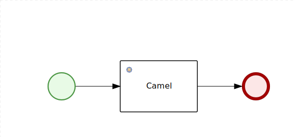
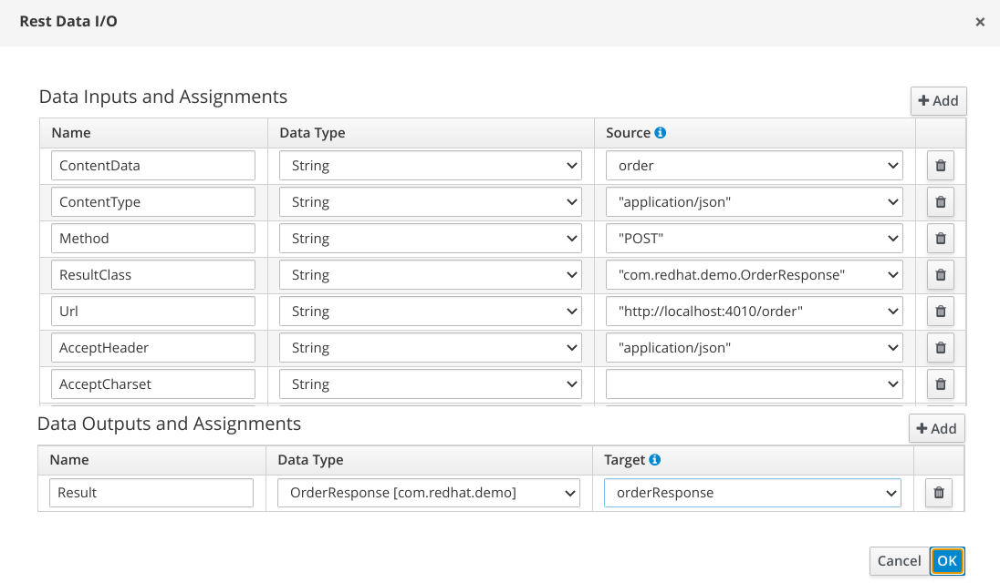

Rest Client Processes
=============================

This project contains two basic processes which goal is to call a rest services exchanging input and output messages.

For sake of simplicity the project contains the data model used for the Rest call payload:

- Input: [Order](src/main/java/com/redhat/demo/Order.java)
- Output: [OrderResponse](src/main/java/com/redhat/demo/OrderResponse.java)

## Rest call

The rest client logic is handled using the default Rest WorkItemHandler.


## Camel rest call

The rest client logic is handled by a custom WorkItemHandler which leverages a Camel Framework.



## Build the Knowledge project from scratch

### Generate the kjar

```sh
mvn archetype:generate \
-DarchetypeGroupId=org.kie \
-DarchetypeArtifactId=kie-kjar-archetype \
-DarchetypeVersion=7.59.0.Final-redhat-00009 \
-Dversion=1.0.0-SNAPSHOT \
-DgroupId=com.redhat.demo \
-DartifactId=rest-wih-kjar
```

Update the pom file to use Java 11:

```xml
    <maven.compiler.target>11</maven.compiler.target>
    <maven.compiler.source>11</maven.compiler.source>
```

### Add the Java Object Model

For sake of simplicity, a simple Java Object Model is defined inside the project to handle the request and the response.

- Request Data Type [Order](rest-wih-kjar/src/main/java/com/redhat/demo/Order.java)
- Response Data Type [OrderResponse](rest-wih-kjar/src/main/java/com/redhat/demo/OrderResponse.java)

### Configure the WorkItemHandler

In order to use a Work Item Handler within a BPMN process, there are two key configurations:

- Add the WIH definition in `kie-deployment-descriptor`
- Add the wid file in the BPMN folder

To configure the default `RESTWorkItemHandler`:

Add the REST WIH definition in the kie deployment descriptor (`rest-wih-kjar/src/main/resources/META-INF/kie-deployment-descriptor.xml`)

```xml
  <work-item-handlers>
    <work-item-handler>
      <resolver>mvel</resolver>
      <identifier>new org.jbpm.process.workitem.rest.RESTWorkItemHandler(classLoader)</identifier>
      <parameters />
      <name>Rest</name>
    </work-item-handler>
  </work-item-handlers>
```

In the folder `rest-wih-kjar/src/main/resources/proc` create the file `rest.wid` and add the content [here](rest-wih-kjar/src/main/resources/proc/rest.wid).

Optionally, add the WIH icon.

### Design the process

- Create the process `rest_call.bpmn` in `rest-wih-kjar/src/main/resources/proc` folder

- Change the process package in `proc`

- Design a process as in the following picture

  

- Configure the REST service data assignments:

  

- Click the SVG button in visual studio code to generate the svg file

### Build and install the kjar

```sh
mvn clean install
```